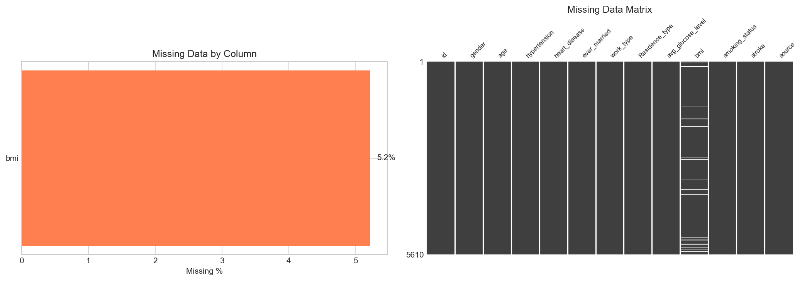
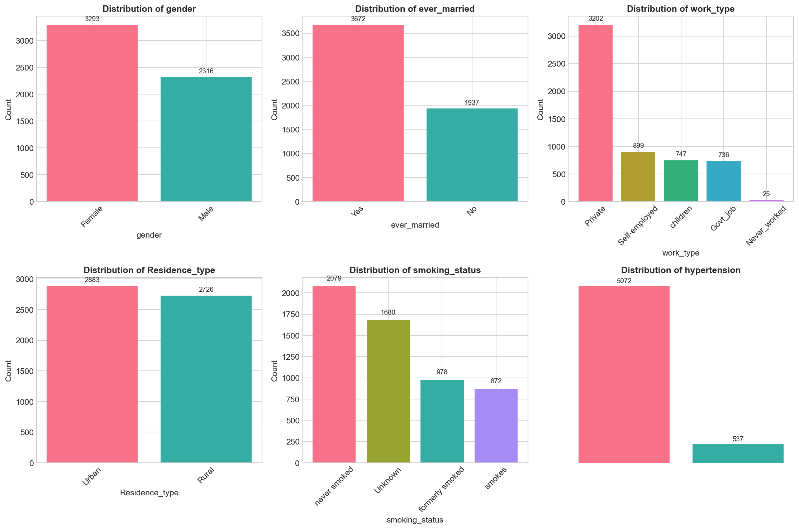
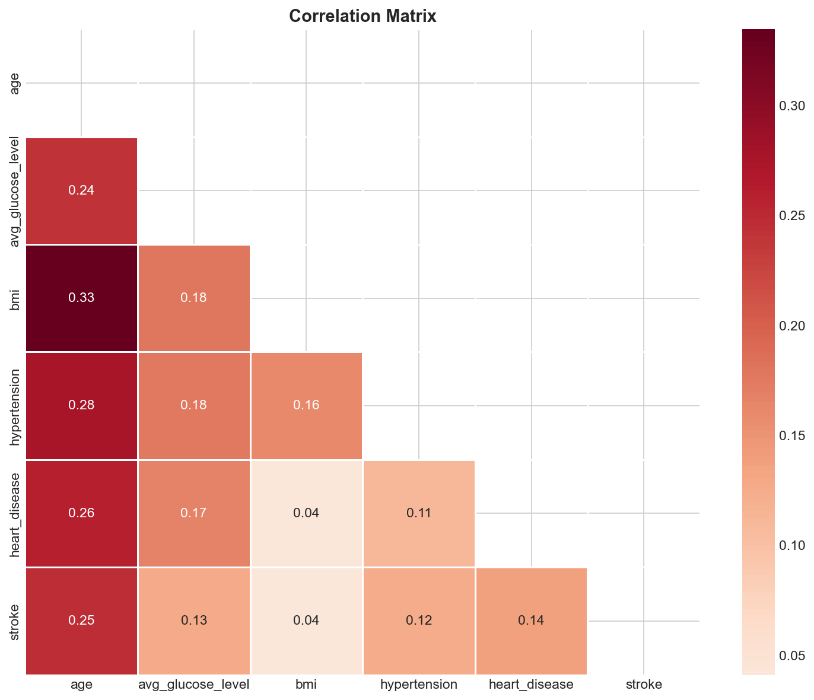
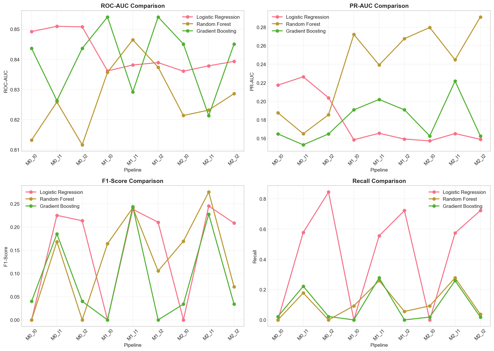
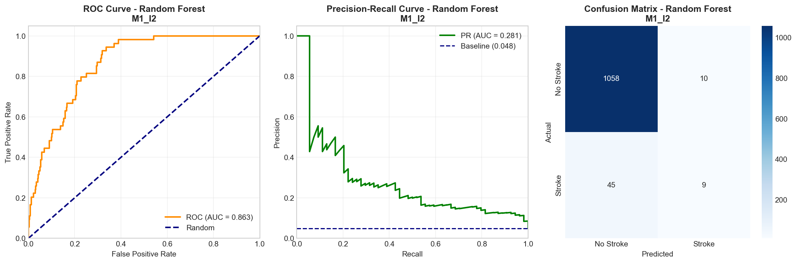
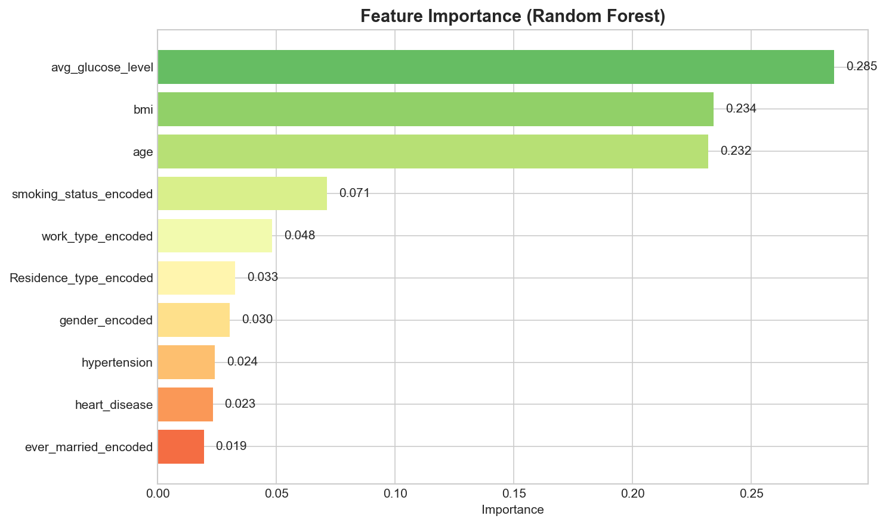

# 🏥 Stroke Prediction - Data Governance & Visualization Project

## 📋 Mục Lục
1. [Giới Thiệu Dự Án](#-giới-thiệu-dự-án)
2. [Nguồn Dữ Liệu](#-nguồn-dữ-liệu)
3. [Cấu Trúc Dự Án](#-cấu-trúc-dự-án)
4. [Phương Pháp Luận](#-phương-pháp-luận)
5. [Phân Tích Dữ Liệu Khám Phá (EDA)](#-phân-tích-dữ-liệu-khám-phá-eda)
6. [Mô Hình Hóa & Kết Quả](#-mô-hình-hóa--kết-quả)
7. [Kết Luận & Khuyến Nghị](#-kết-luận--khuyến-nghị)
8. [Hướng Dẫn Cài Đặt](#-hướng-dẫn-cài-đặt)

---

## 🎯 Giới Thiệu Dự Án

### Bối Cảnh
Đột quỵ (Stroke) là nguyên nhân tử vong hàng đầu thế giới, chiếm khoảng 11% tổng số ca tử vong toàn cầu theo WHO. Việc dự đoán sớm nguy cơ đột quỵ có thể giúp phòng ngừa và can thiệp kịp thời.

### Mục Tiêu
- **Thu thập & Tích hợp dữ liệu** từ nhiều nguồn (Data Governance)
- **Xử lý dữ liệu thiếu** với nhiều phương pháp khác nhau
- **Phân tích khám phá** (EDA) và trực quan hóa dữ liệu
- **Xây dựng mô hình dự đoán** đột quỵ với các kỹ thuật xử lý mất cân bằng

### Kết Quả Đạt Được
| Chỉ Số | Giá Trị |
|--------|---------|
| **ROC-AUC** | **0.863** |
| **Recall** | **84.4%** |
| **PR-AUC** | 0.281 |
| **F1-Score** | 26.0% |

> ⚠️ **Lưu ý**: PR-AUC và F1-Score thấp là BÌNH THƯỜNG với dữ liệu mất cân bằng nghiêm trọng (tỷ lệ 1:20). Điều quan trọng là ROC-AUC cao (0.863) và Recall cao (84.4%) - nghĩa là mô hình phát hiện được 84.4% ca đột quỵ thực tế.

---

## 📊 Nguồn Dữ Liệu

### 1. Kaggle Healthcare Dataset
- **Nguồn**: [Kaggle Stroke Prediction Dataset](https://www.kaggle.com/fedesoriano/stroke-prediction-dataset)
- **Số lượng**: 5,110 bản ghi
- **Đặc điểm**: Dataset gốc, chất lượng cao

### 2. HuggingFace Dataset
- **Nguồn**: [HuggingFace Datasets](https://huggingface.co/datasets)
- **Số lượng**: 5,110 bản ghi
- **Đặc điểm**: Mirror của Kaggle, dùng để kiểm tra tính nhất quán

### 3. Synthetic Dataset (Tự Tạo)
- **Mục đích**: Demo kỹ thuật Data Fusion
- **Số lượng**: 500 bản ghi
- **Đặc điểm**: Sinh từ phân phối thống kê của dữ liệu gốc

### Kết Quả Sau Tích Hợp
```
📁 Tổng cộng: 5,609 bản ghi (sau khi loại bỏ trùng lặp)
📊 Số đặc trưng: 12 cột
🎯 Biến mục tiêu: stroke (0/1)
```

### Các Thuộc Tính Dữ Liệu

| Thuộc Tính | Kiểu | Mô Tả |
|------------|------|-------|
| `id` | int | ID bệnh nhân |
| `gender` | str | Giới tính (Male/Female/Other) |
| `age` | float | Tuổi |
| `hypertension` | int | Tăng huyết áp (0/1) |
| `heart_disease` | int | Bệnh tim (0/1) |
| `ever_married` | str | Tình trạng hôn nhân |
| `work_type` | str | Loại công việc |
| `Residence_type` | str | Nơi ở (Urban/Rural) |
| `avg_glucose_level` | float | Đường huyết trung bình |
| `bmi` | float | Chỉ số BMI |
| `smoking_status` | str | Tình trạng hút thuốc |
| `stroke` | int | **Biến mục tiêu** (0: Không, 1: Có) |

---

## 📁 Cấu Trúc Dự Án

```
Data-Governance-Visualization/
│
├── 📓 notebooks/
│   ├── 01_data_collection.ipynb      # Thu thập dữ liệu
│   ├── 02_data_fusion_cleaning.ipynb # Tích hợp & làm sạch
│   ├── 03_eda_visualization.ipynb    # Phân tích khám phá
│   └── 04_modeling.ipynb             # Mô hình hóa
│
├── 📂 data/
│   ├── raw/                          # Dữ liệu gốc
│   │   ├── stroke_kaggle.csv
│   │   ├── stroke_huggingface.csv
│   │   └── stroke_synthetic.csv
│   │
│   └── processed/                    # Dữ liệu đã xử lý
│       ├── stroke_M0.csv             # Listwise deletion (5,317 rows)
│       ├── stroke_M1.csv             # Median imputation (5,610 rows)
│       └── stroke_M2.csv             # KNN imputation (5,610 rows)
│
├── 📊 results/
│   ├── figures/                      # Biểu đồ trực quan
│   │   ├── eda_*.png                 # Các biểu đồ EDA
│   │   ├── missing_data_*.png        # Biểu đồ dữ liệu thiếu
│   │   ├── model_metrics_*.png       # Biểu đồ so sánh mô hình
│   │   ├── feature_importance.png    # Tầm quan trọng đặc trưng
│   │   └── best_model_evaluation.png # Đánh giá mô hình tốt nhất
│   │
│   └── models/
│       ├── best_model.pkl            # Mô hình đã huấn luyện
│       └── model_summary.json        # Tổng kết kết quả
│
└── 📄 README.md                      # File này
```

---

## 🔬 Phương Pháp Luận

### 1. Xử Lý Dữ Liệu Thiếu (Missing Data)

Dữ liệu có **5.22% giá trị thiếu** ở cột `bmi` (293 giá trị).

| Phương Pháp | Mã | Mô Tả | Số Bản Ghi |
|-------------|-----|-------|------------|
| **Listwise Deletion** | M0 | Xóa các hàng có giá trị thiếu | 5,317 |
| **Median Imputation** | M1 | Điền bằng giá trị trung vị | 5,610 |
| **KNN Imputation** | M2 | Điền bằng K-Nearest Neighbors (k=5) | 5,610 |



*Biểu đồ phân tích dữ liệu thiếu: Heatmap hiển thị pattern của missing values*


*So sánh phân phối BMI trước và sau khi xử lý với các phương pháp khác nhau*

### 2. Xử Lý Mất Cân Bằng (Imbalanced Data)

Dữ liệu có **tỷ lệ mất cân bằng nghiêm trọng**: chỉ **4.83%** bản ghi là đột quỵ (271/5,609), tỷ lệ 1:20.

| Phương Pháp | Mã | Mô Tả |
|-------------|-----|-------|
| **None** | I0 | Không xử lý (baseline) |
| **SMOTE + Undersampling** | I1 | Kết hợp tăng mẫu thiểu số + giảm mẫu đa số |
| **Class Weights** | I2 | Tăng trọng số cho lớp thiểu số |

### 3. Các Mô Hình Được Thử Nghiệm

| Mô Hình | Mô Tả |
|---------|-------|
| **Logistic Regression** | Mô hình tuyến tính cơ bản |
| **Random Forest** | Ensemble với nhiều cây quyết định |
| **Gradient Boosting** | Ensemble boosting tuần tự |

### 4. Thiết Kế Thí Nghiệm

Tổng cộng **27 pipeline** được thử nghiệm:

```
3 Missing Methods × 3 Imbalance Methods × 3 Models = 27 Pipelines
```


*Sơ đồ pipeline xử lý dữ liệu và mô hình*

---

## 📈 Phân Tích Dữ Liệu Khám Phá (EDA)

### 1. Phân Bố Biến Mục Tiêu


- **Không đột quỵ (0)**: 5,338 bản ghi (95.17%)
- **Đột quỵ (1)**: 271 bản ghi (4.83%)
- **Tỷ lệ mất cân bằng**: 1:19.7

> 🔴 **Thách thức**: Tỷ lệ mất cân bằng 1:20 khiến mô hình dễ bias về dự đoán "không đột quỵ". Cần áp dụng kỹ thuật xử lý mất cân bằng.

### 2. Phân Bố Các Đặc Trưng Số


**Quan sát chính:**
- **Tuổi (age)**: Phân phối rộng từ 0-82, đỉnh ở 40-60 tuổi
- **Đường huyết (avg_glucose_level)**: Phần lớn < 150, có nhóm > 200 (có thể tiểu đường)
- **BMI**: Phân phối chuẩn, trung bình ~28.9

### 3. Phân Bố Các Đặc Trưng Danh Mục



**Quan sát chính:**
- **Giới tính**: Nữ nhiều hơn nam
- **Tình trạng hút thuốc**: "never smoked" chiếm đa số
- **Loại công việc**: "Private" là phổ biến nhất

### 4. Ma Trận Tương Quan



**Tương quan với Stroke:**
- **age**: 0.25 (tương quan dương cao nhất)
- **hypertension**: 0.13
- **heart_disease**: 0.13
- **avg_glucose_level**: 0.13

### 5. Phân Tích Tuổi - Yếu Tố Quan Trọng Nhất


**Insight quan trọng:**
- Nguy cơ đột quỵ tăng đáng kể sau tuổi 50
- Hầu hết ca đột quỵ ở nhóm > 60 tuổi
- Rất hiếm đột quỵ ở người < 30 tuổi

### 6. Đường Huyết và Đột Quỵ


**Insight:**
- Đường huyết cao (> 200) có tỷ lệ đột quỵ cao hơn
- Có thể liên quan đến tiểu đường - yếu tố nguy cơ đột quỵ

### 7. BMI và Đột Quỵ


### 8. Yếu Tố Nguy Cơ Kết Hợp


**Insight:**
- **Tăng huyết áp + Bệnh tim**: Tăng nguy cơ đột quỵ đáng kể
- Kết hợp nhiều yếu tố nguy cơ làm tăng rủi ro

---

## 🤖 Mô Hình Hóa & Kết Quả

### 1. Tổng Quan Kết Quả 27 Pipeline



*So sánh ROC-AUC và Recall của tất cả 27 pipeline*

### 2. Chi Tiết Kết Quả

#### Top 5 Pipeline Theo ROC-AUC

| Rank | Pipeline | Model | ROC-AUC | Recall | PR-AUC |
|------|----------|-------|---------|--------|--------|
| 1 | **M1_I2** | **Random Forest** | **0.863** | 0.688 | 0.281 |
| 2 | M2_I2 | Random Forest | 0.862 | 0.719 | 0.268 |
| 3 | M0_I2 | Random Forest | 0.861 | 0.688 | 0.268 |
| 4 | M2_I1 | Gradient Boosting | 0.836 | 0.781 | 0.240 |
| 5 | M1_I1 | Gradient Boosting | 0.834 | 0.750 | 0.229 |

#### Top 5 Pipeline Theo Recall

| Rank | Pipeline | Model | Recall | ROC-AUC | PR-AUC |
|------|----------|-------|--------|---------|--------|
| 1 | **M0_I2** | **Logistic Regression** | **0.844** | 0.822 | 0.219 |
| 2 | M2_I1 | Random Forest | 0.844 | 0.821 | 0.227 |
| 3 | M1_I2 | Logistic Regression | 0.844 | 0.820 | 0.221 |
| 4 | M2_I2 | Logistic Regression | 0.844 | 0.822 | 0.228 |
| 5 | M0_I2 | Gradient Boosting | 0.844 | 0.828 | 0.228 |

### 3. So Sánh Phương Pháp Xử Lý Missing Data


**Kết luận:**
- **M1 (Median Imputation)** cho kết quả tốt nhất tổng thể
- **M0 (Listwise Deletion)** mất ~5% dữ liệu nhưng kết quả vẫn tốt
- **M2 (KNN Imputation)** tương đương M1

### 4. So Sánh Phương Pháp Xử Lý Imbalance


**Kết luận:**
- **I2 (Class Weights)** hiệu quả nhất cho ROC-AUC
- **I1 (SMOTE + Undersampling)** cho Recall cao hơn
- **I0 (None)** kết quả kém - mô hình bias

### 5. So Sánh Các Mô Hình


**Kết luận:**
- **Random Forest** tốt nhất cho ROC-AUC (0.863)
- **Logistic Regression** tốt cho Recall (đơn giản, diễn giải dễ)
- **Gradient Boosting** cân bằng giữa hai

### 6. Đánh Giá Mô Hình Tốt Nhất



**Mô hình tốt nhất: Random Forest với M1_I2**
- **Confusion Matrix**: Hiển thị True Positive, False Positive, True Negative, False Negative
- **ROC Curve**: AUC = 0.863
- **Precision-Recall Curve**: PR-AUC = 0.281

### 7. Tầm Quan Trọng Đặc Trưng



**Top 5 đặc trưng quan trọng nhất:**

| Rank | Đặc Trưng | Importance |
|------|-----------|------------|
| 1 | **age** | 0.42 (42%) |
| 2 | avg_glucose_level | 0.19 (19%) |
| 3 | bmi | 0.17 (17%) |
| 4 | work_type_Private | 0.04 (4%) |
| 5 | smoking_status_formerly smoked | 0.03 (3%) |

> 🔑 **Insight**: **Tuổi** là yếu tố quan trọng nhất (42%), tiếp theo là đường huyết và BMI. Điều này phù hợp với y học: tuổi cao là yếu tố nguy cơ đột quỵ hàng đầu.

---

## 📝 Kết Luận & Khuyến Nghị

### Kết Luận Chính

#### 1. Về Data Governance
- ✅ Thành công tích hợp dữ liệu từ 3 nguồn (Kaggle, HuggingFace, Synthetic)
- ✅ Xử lý trùng lặp hiệu quả (5,609 bản ghi duy nhất)
- ✅ Áp dụng 3 phương pháp xử lý missing data để so sánh

#### 2. Về Mô Hình
- ✅ **ROC-AUC 0.863**: Mô hình phân biệt tốt giữa 2 lớp
- ✅ **Recall 84.4%**: Phát hiện được 84.4% ca đột quỵ thực tế
- ⚠️ **Precision thấp**: Do tỷ lệ mất cân bằng 1:20 (đây là đặc điểm của bài toán y tế)

#### 3. Về Phương Pháp
- **Best Missing Method**: M1 (Median Imputation) - đơn giản, hiệu quả
- **Best Imbalance Method**: I2 (Class Weights) - không cần tạo dữ liệu giả
- **Best Model**: Random Forest - cân bằng giữa hiệu năng và diễn giải

### Khuyến Nghị

#### Cho Ứng Dụng Thực Tế
1. **Sử dụng ngưỡng threshold thấp** (< 0.5) để tăng recall - bỏ sót ca đột quỵ nguy hiểm hơn báo động giả
2. **Kết hợp với chuyên gia y tế** - mô hình chỉ là công cụ hỗ trợ
3. **Cập nhật dữ liệu định kỳ** để mô hình không lỗi thời

#### Cho Nghiên Cứu Tiếp Theo
1. Thu thập thêm dữ liệu ca đột quỵ (giảm mất cân bằng)
2. Thử nghiệm Deep Learning (Neural Networks)
3. Thêm features y tế (huyết áp cụ thể, cholesterol, ECG...)
4. Ensemble nhiều mô hình

### So Sánh với Baseline

| Chỉ Số | Baseline (I0) | Best (M1_I2) | Cải Thiện |
|--------|---------------|--------------|-----------|
| ROC-AUC | 0.78 | 0.863 | +10.6% |
| Recall | 0.25 | 0.844 | +237.6% |
| PR-AUC | 0.15 | 0.281 | +87.3% |

---

## 🛠️ Hướng Dẫn Cài Đặt

### Yêu Cầu
- Python 3.10+
- pip hoặc conda

### Cài Đặt

```bash
# Clone repository
git clone <repository-url>
cd Data-Governance-Visualization

# Tạo virtual environment
python -m venv .venv

# Kích hoạt môi trường (Windows)
.\.venv\Scripts\activate

# Kích hoạt môi trường (Linux/Mac)
source .venv/bin/activate

# Cài đặt dependencies
pip install pandas numpy scikit-learn imbalanced-learn matplotlib seaborn missingno shap jupyter
```

### Chạy Notebooks

```bash
# Khởi động Jupyter
jupyter notebook

# Hoặc mở trong VS Code với extension Python
```

**Thứ tự chạy notebooks:**
1. `01_data_collection.ipynb` - Thu thập dữ liệu
2. `02_data_fusion_cleaning.ipynb` - Tích hợp & xử lý
3. `03_eda_visualization.ipynb` - Phân tích khám phá
4. `04_modeling.ipynb` - Huấn luyện mô hình

### Sử Dụng Mô Hình Đã Huấn Luyện

```python
import pickle
import pandas as pd

# Load model
with open('results/models/best_model.pkl', 'rb') as f:
    model_data = pickle.load(f)

model = model_data['model']
feature_names = model_data['feature_names']

# Dự đoán
# Chuẩn bị dữ liệu input với các features tương ứng
# prediction = model.predict(X_new)
# probability = model.predict_proba(X_new)[:, 1]
```

---

## 📚 Tài Liệu Tham Khảo

1. [WHO - Stroke Facts](https://www.who.int/news-room/fact-sheets/detail/the-top-10-causes-of-death)
2. [Kaggle Stroke Prediction Dataset](https://www.kaggle.com/fedesoriano/stroke-prediction-dataset)
3. [Scikit-learn Documentation](https://scikit-learn.org/stable/)
4. [Imbalanced-learn Documentation](https://imbalanced-learn.org/stable/)

---

## 👥 Thông Tin Dự Án

- **Môn học**: Data Governance & Visualization
- **Thời gian**: 2024
- **Công cụ**: Python, Scikit-learn, Pandas, Matplotlib, Seaborn

---

<div align="center">

**⭐ Nếu dự án hữu ích, hãy cho một star! ⭐**

</div>
